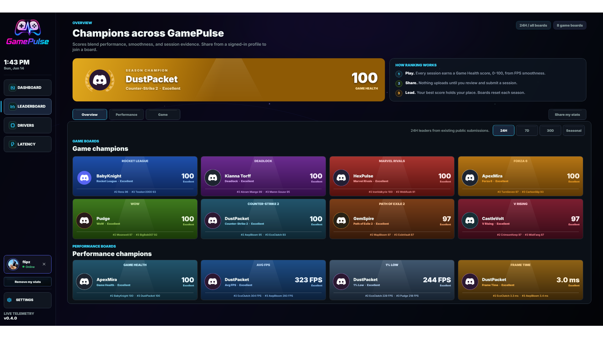
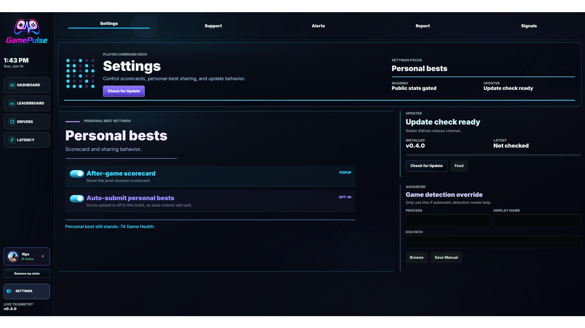

### Real-time gaming performance dashboard for Windows

**FPS · frame pacing · Game Health · leaderboards** — external, anti-cheat-safe, local-first.

[Is it safe?](#-is-this-safe-to-run) ·
[Privacy &amp; Security](#-privacy--security) ·
[Features](#-features) ·
[Updates](#-how-updates-work) ·
[All releases](https://github.com/ppgnox/gameflipz-native-releases/releases)

---

GamePulse is a lightweight Windows app that shows your real-time gaming performance — frames per
second, frame timing, 1% lows, and a 0–100 **Game Health** score — in a clean cockpit dashboard.
It measures everything **from outside the game** using Intel PresentMon (the same ETW telemetry
Windows already exposes), so there are no overlays, no injection, and nothing that touches the game
itself. Your data stays on your PC unless you choose to share it.

## ⬇️ Download

**[Download GamePulse-Setup.exe](https://github.com/ppgnox/gameflipz-native-releases/releases/latest/download/GamePulse-Setup.exe)** — this link always grabs the newest version.

Prefer to see what's in each version first? Open the [**latest release**](https://github.com/ppgnox/gameflipz-native-releases/releases/latest)
and grab `GamePulse-Setup.exe` (or the version-stamped `GamePulse-Friend-Setup-<version>.exe`).

Then run it — there's no separate runtime to install, the app is fully self-contained. (See
[Is this safe to run?](#-is-this-safe-to-run) for the Windows prompt you'll see.)

## 🛡️ Is this safe to run?

When you launch the installer, Windows **SmartScreen** may show *"Windows protected your PC / unknown publisher."*
That is expected, and here's the honest reason:

> GamePulse is currently signed with our **own development certificate**, not a paid
> publicly-trusted one yet. SmartScreen flags new publishers until they build reputation — it is a
> **trust/reputation prompt, not a malware detection.** A publicly-trusted certificate is on the roadmap.

To continue: click **More info → Run anyway**.

Want to verify the download yourself? Each release lists the exact **SHA-256** of every asset, and the
app updates only from this public feed over HTTPS. You can re-check any package with
`vpk download github` or by comparing hashes against the release notes.

## 🔒 Privacy &amp; Security

GamePulse is built to be **anti-cheat conservative** and **local-first**.

**It does _not_:**
- inject code into games, or hook DirectX / Vulkan / OpenGL
- read or write game memory, attach a debugger, or modify game files
- run an in-game overlay or install a kernel driver
- collect ads/tracking telemetry

**It _does_:**
- measure FPS and frame timing **externally** via Intel PresentMon / ETW
- keep your performance data **on your PC** (`%LOCALAPPDATA%\GamePulse`)
- share **nothing** by default — public leaderboards and Discord sign-in are **opt-in**

If you opt in to the public leaderboard, only the stats you submit plus your chosen display name and
avatar are shared. **Your Discord user ID is never exposed** in public data, and you can remove your
shared stats at any time from inside the app.

## ✨ Features

- **Live performance cockpit** — FPS, frame time, 1% lows, and frame-pacing gauges in real time.
- **Game Health score (0–100)** — blends raw performance with smoothness into one number.
- **Automatic game detection** — recognizes your running game and labels it cleanly.
- **Leaderboards (opt-in)** — Overview, per-game, and performance boards (Avg FPS, 1% Low, Frame Time)
  with a podium and full standings.
- **After-game scorecard** — see your personal best the moment you close a game.
- **Latency &amp; Windows readiness checks** — frame-path and DPC signals in one place.
- **No-admin FPS capture** — uses the PresentMon shared service so it works without running as admin.
- **System at a glance** — CPU, GPU, RAM, and VRAM readouts.

## 💻 System requirements

- **Windows 10 or 11, 64-bit (x64)**
- ~85 MB download, self-contained (no .NET install needed)
- One optional **UAC prompt** to install the PresentMon FPS service (enables no-admin capture)

## 🔄 How updates work

GamePulse updates itself from this public feed using **Velopack** — there is **no silent or forced
install.** Inside the app:

1. Open the **Package** page.
2. **Check for Update → Download Update → Restart to Finish.**

You'll also see a small in-app popup with the latest patch highlights when an update is available.

## 📦 About this repository

This is the **public release feed** for GamePulse (Velopack packages + release metadata). The
application source code is maintained privately. Releases here are what the in-app updater reads.

## 📄 License

**Proprietary — © GamePulse. Free for personal use; all rights reserved.** The published binaries
may be downloaded and used at no cost; the source code is not open-source.
