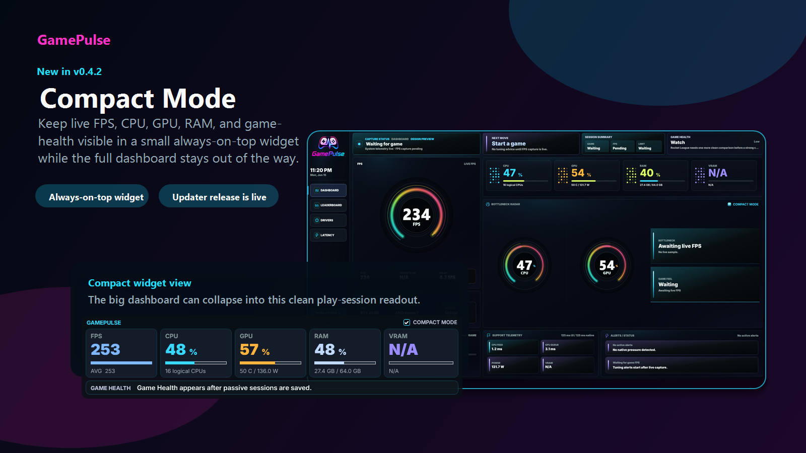

### Native Windows performance companion for PC gaming

**Compact Mode | live FPS | frame pacing | Game Health | public leaderboards**

[Install](docs/install.md) |
[Screenshots](docs/screenshots.md) |
[Privacy & Safety](docs/privacy-and-safety.md) |
[Status](docs/status.md) |
[Support](docs/support.md) |
[All releases](https://github.com/ppgnox/gameflipz-native-releases/releases)

---

GamePulse is a lightweight Windows app that shows your real-time gaming performance without becoming a game overlay. It tracks FPS, frame timing, system pressure, game sessions, public leaderboard results, driver readiness, and latency signals from outside the game using native Windows telemetry paths.

Your data stays on your PC unless you choose to share public leaderboard stats.

## New In v0.4.2: Compact Mode

Compact Mode is the headline feature in `v0.4.2`: a smaller always-on-top GamePulse cockpit for active play sessions. Keep live FPS, CPU, GPU, RAM, VRAM, and game-health context visible while the full dashboard stays out of the way.

- Smaller play-session widget for quick glances.
- Same external telemetry model as the full dashboard.
- No overlays, injection, hooks, game memory access, or game-file changes.
- Ships with Counter-Strike 2 profile support, opt-in CPU/RAM process popups, chipset fallback improvements, latency copy cleanup, and updater package fixes.

## Download

**Recommended:** [Download GamePulse-Friend-Setup-0.4.2.exe](https://github.com/ppgnox/gameflipz-native-releases/releases/download/v0.4.2/GamePulse-Friend-Setup-0.4.2.exe)

Prefer to read the notes first? Open [GamePulse 0.4.2](https://github.com/ppgnox/gameflipz-native-releases/releases/tag/v0.4.2) and download the branded setup from the release assets.

GamePulse is self-contained. You do not need to install .NET separately.

## Feature Highlights

| Area | What it gives players |
| --- | --- |
| Compact Mode | A smaller always-on-top readout for live FPS, CPU, GPU, RAM, VRAM, and game-health context. |
| Performance cockpit | Full dashboard with FPS, frame time, capture health, bottleneck context, and system pressure. |
| Public leaderboards | Opt-in Discord-linked score sharing across supported games and performance boards. |
| Driver and latency checks | Local inventory cards, chipset/GPU guidance, read-only Windows latency checks, and input-stack summaries. |
| Player-controlled diagnostics | CPU/RAM process popups are opt-in and clearly labeled because they use extra CPU while open. |
| Updater support | Installed builds check this public release feed and install only after the user chooses to update. |

## Screenshots

More screenshots: [docs/screenshots.md](docs/screenshots.md)

## Is This Safe To Run?

Windows may show **SmartScreen / unknown publisher** when you run the installer. That is expected right now because GamePulse is not yet signed with a production-trusted certificate. It is a Windows publisher-reputation prompt, not a malware detection.

To continue, choose **More info**, then **Run anyway**.

Each release lists hashes for its assets, and installed builds update only from this public GitHub release feed over HTTPS.

## Privacy And Safety

GamePulse is intentionally anti-cheat conservative:

- no game overlay,
- no DLL injection,
- no DirectX/Vulkan/OpenGL hooks,
- no game memory reads or writes,
- no debugger attach,
- no game file modification,
- no kernel driver,
- no hidden background capture behavior.

Public leaderboards are opt-in. Nothing uploads until you sign in and choose to share eligible stats.

Read the full page: [Privacy and Safety](docs/privacy-and-safety.md)

## How Updates Work

GamePulse uses Velopack and this public GitHub repo as the update feed. Updates are not silent:

1. Open GamePulse.
2. Go to the **Package** page.
3. Choose **Check for Update**.
4. Download and restart only when you choose to install.

## Current Notes

- Latest public version: `v0.4.2`.
- **Report a bug** is visible in the app, but not connected yet.
- Production-trusted signing is planned; SmartScreen prompts remain expected for now.
- Public stats and leaderboards are opt-in.

See: [Status and Roadmap](docs/status.md)

## About This Repository

This is the public release and updater-feed repository for GamePulse. It hosts installer assets, Velopack packages, release metadata, screenshots, and public-facing support docs.

The application source code is maintained separately.

## Social Preview

Use `assets/social-preview.png` for this repository's GitHub social preview image. See [docs/github-social-preview.md](docs/github-social-preview.md).

## License

**Proprietary - Copyright GamePulse. Free for personal use; all rights reserved.**

The published binaries may be downloaded and used at no cost. The source code is not open-source.
