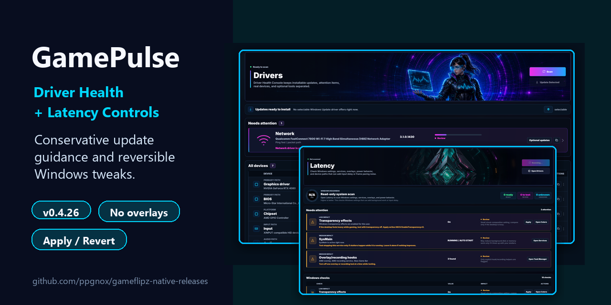

# GitHub Social Preview

The social preview image for this repository should use:

```text
assets/social-preview.png
```



GitHub currently exposes this as a repository Settings upload, not a normal `gh repo edit` or REST API field.

To set it:

1. Open the repository on GitHub.
2. Go to **Settings**.
3. Find **Social preview**.
4. Upload `assets/social-preview.png`.

Recommended source file in this repository:

```text
assets/social-preview.png
```
