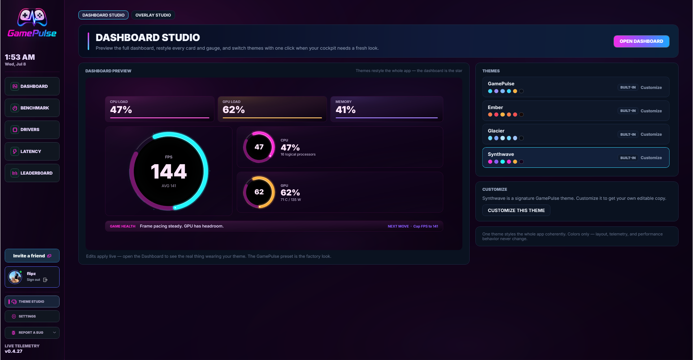
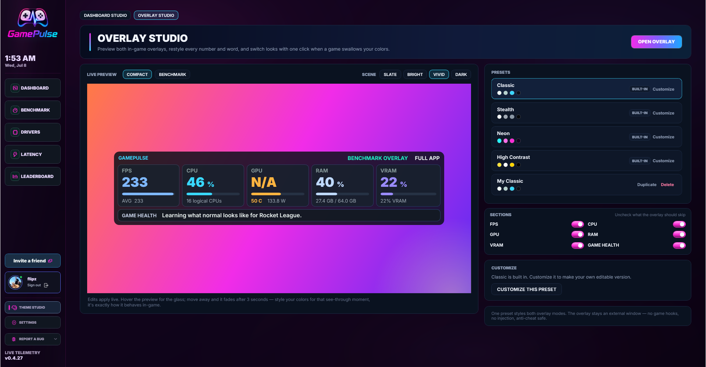
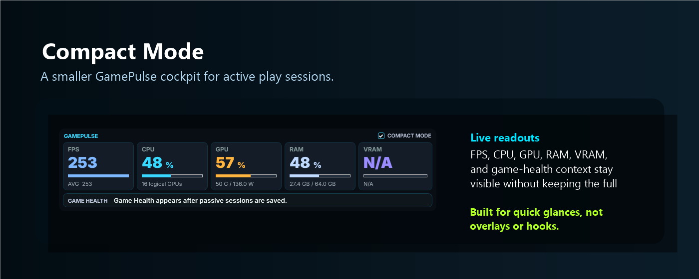
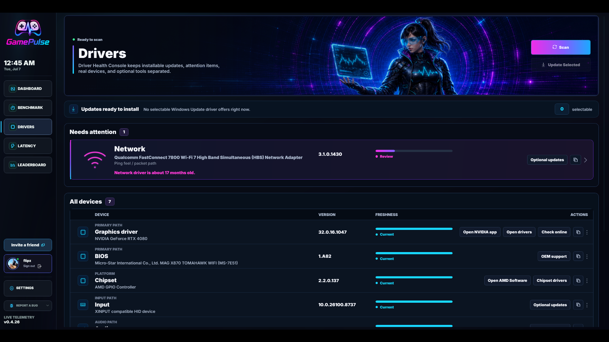
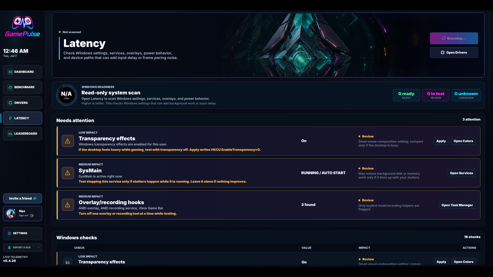
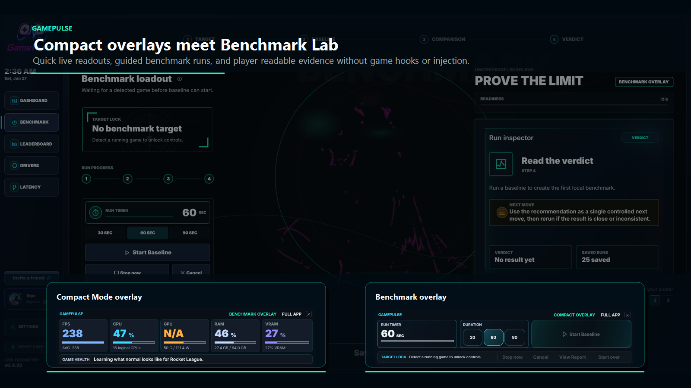
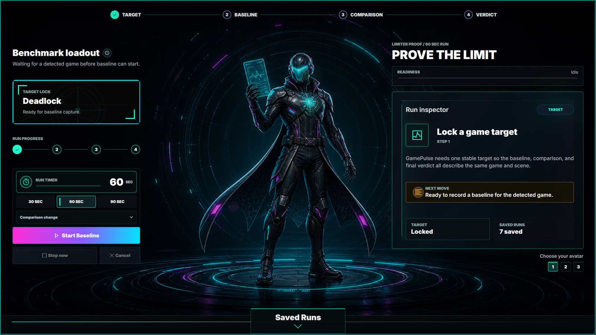
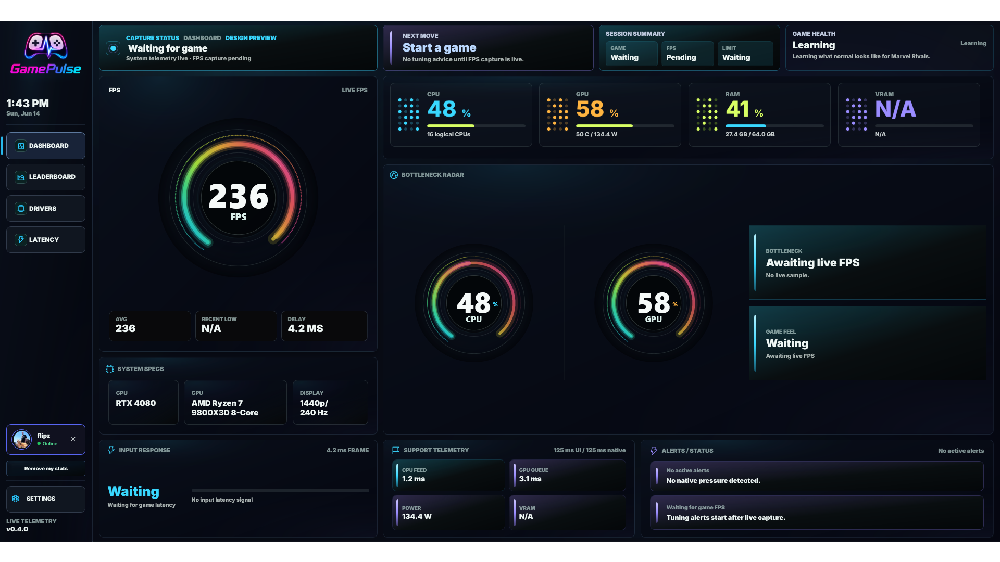
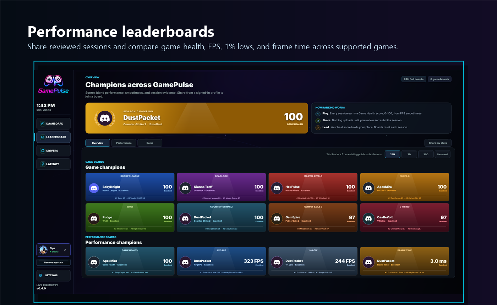
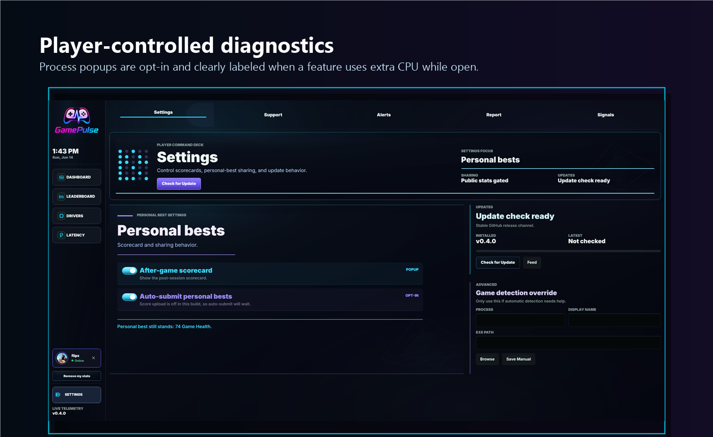

# GamePulse Screenshots

These captures show the current GamePulse experience. They use real product screens and stay outside the game, with no overlay, injection, hooks, or game-memory access.

## Theme Studio

Theme Studio lets players choose app-wide Dashboard palettes, save custom colors, and see preview updates immediately.

## Overlay Studio

Overlay Studio lets players tune Compact Mode colors, background opacity, borders, and effects while GamePulse remains outside the game.

## Compact Mode

Compact Mode keeps live FPS, CPU, GPU, RAM, VRAM, and game-health context visible in a smaller always-on-top widget while the full dashboard stays out of the way.

## Driver Health Console

Driver Health separates installable updates, attention items, real devices, and optional vendor tools so update guidance does not blur into inventory.

## Latency Controls

Latency checks explain Windows, input, display, network, service, overlay, and security settings, with explicit Apply/Revert controls for selected HKCU tweaks.

## Compact Overlays And Benchmark Lab

The compact Dashboard overlay and Benchmark overlay keep quick reads and guided runs available without becoming a game overlay.

## Benchmark Page

Benchmark guides a target-locked baseline run, a comparison run, and one combined saved report so settings changes are easier to judge.

## Full Dashboard

The full dashboard gives a cockpit view of live FPS, capture state, system pressure, bottleneck context, input response, and alerts.

## Public Leaderboards

Public stats are opt-in. Players can review and submit sessions, then compare performance across supported game boards and performance categories.

## Settings And Diagnostics

Settings keep sharing, updates, manual game detection, and optional diagnostics under player control. CPU/RAM process popups are opt-in because they use extra CPU while open.

## Social Preview

Use this image for the GitHub repository social preview when editing the repo settings.

